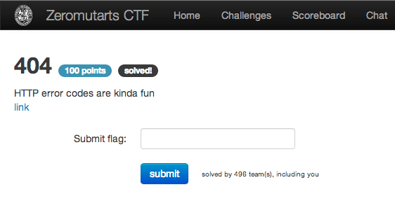
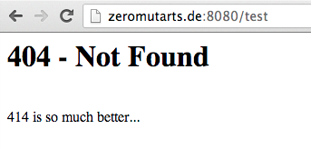
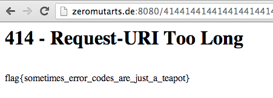

404
===

Flag: **sometimes_error_codes_are_just_a_teapot**

The challenge flavortext says that "HTTP error codes are kinda fun" and links to
<http://zeromutarts.de:8080/>.

If we visit a URI for a non-existent resource, we see a custom 404 error page
saying that "414 is so much better...":

The 414 HTTP status code means [Request URI too
long](http://www.checkupdown.com/status/E414.html "definition of the 414 HTTP
status code"), so let's visit a URI longer than the server limit:

The custom 414 error page contains the flag.

or, via curl:

    $ curl http://zeromutarts.de:8080/`python -c 'print "414"*1000'`
    <h1>414 - Request-URI Too Long</h1> flag{sometimes_error_codes_are_just_a_teapot}

The flag is thus `sometimes_error_codes_are_just_a_teapot`.

The teapot is a reference to the April Fools' Day RFC on the [Hyper Text Coffee
Pot Control
Protocol](https://en.wikipedia.org/wiki/Hyper_Text_Coffee_Pot_Control_Protocol
"Hyper Text Coffee Pot Control Protocol").
