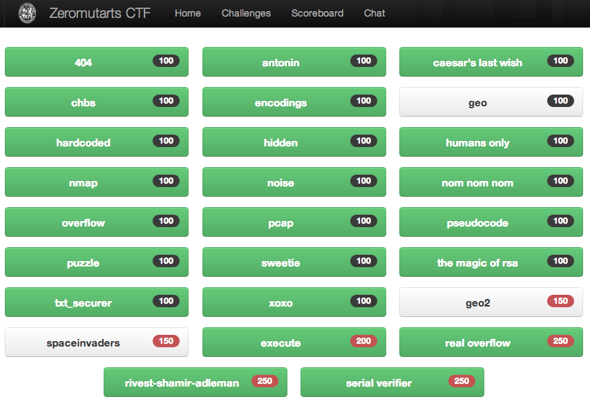

Zeromutarts Capture the Flag 2013 challenge writeups
====================================================

Below are writeups for all of the Zeromutarts Capture the Flag 2013 challenges,
with the exception of 3 challenges that required you to be at the event and
which appear in white on the board.

* [404 (100 points)](404/404.md "404 (100 points)")
* [antonin (100 points)](antonin/antonin.md "antonin (100 points)")
* [caesar's last wish (100 points)](caesar/caesar.md "caesar's last wish (100 points)")
* [chbs (100 points)](chbs/chbs.md "chbs (100 points)")
* [encodings (100 points)](encodings/encodings.md "encodings (100 points)")
* [hardcoded (100 points)](hardcoded/hardcoded.md "hardcoded (100 points)")
* [hidden (100 points)](hidden/hidden.md "hidden (100 points)")
* [humans only (100 points)](humans_only/humans_only.md "humans only (100 points)")
* [nmap (100 points)](nmap/nmap.md "nmap (100 points)")
* [noise (100 points)](noise/noise.md "noise (100 points)")
* [nom nom nom (100 points)](nom/nom.md "nom nom nom (100 points)")
* [overflow (100 points)](overflow/overflow.md "overflow (100 points)")
* [pcap (100 points)](pcap/pcap.md "pcap (100 points)")
* [pseudocode (100 points)](pseudocode/pseudocode.md "pseudocode (100 points)")
* [puzzle (100 points)](puzzle/puzzle.md "puzzle (100 points)")
* [sweetie (100 points)](sweetie/sweetie.md "sweetie (100 points)")
* [the magic of rsa (100 points)](rsa/rsa.md "the magic of rsa (100 points)")
* [txt_securer (100 points)](txt_securer/txt_securer.md "txt_securer (100 points)")
* [xoxo (100 points)](xoxo/xoxo.md "xoxo (100 points)")
* [execute (200 points)](execute/execute.md "execute (100 points)")
* [real overflow (250 points)](real_overflow/real_overflow.md "real overflow (250 points)")
* [rivest-shamir-adleman (250 points)](rivest/rivest.md "rivest-shamir-adleman (250 points)")
* [serial verifier (250 points)](serial_verifier/serial_verifier.md "serial verifier (250 points)")
