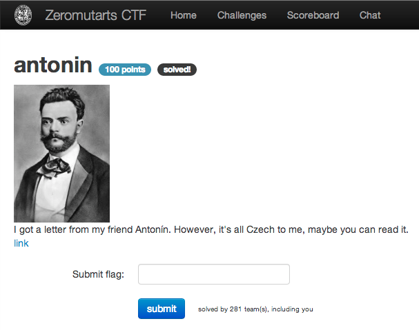

antonin
=======

Flag: **feel_so_bohemian_like_you**

The challenge flavortext says "I got a letter from my friend Antonín. However,
it's all Czech to me, maybe you can read it" and links to a text file containing
a cipher:

> E.ap ipc.bew

> C dgoy ,aby yt n.y ötg rbt, yh. o.jp.y itp yh. .bjpözy.e ojptnn C o.by ötgv Go. cy ,co.nö abe et bty uck. cy yt abötb.v

> Yh. o.jp.y coV inau{i..n'ot'xth.mcab'ncr.'ötg}

This appears to be a whitespace, curly-brace, and case-preserving substitution
cipher. We could do some frequency analysis, but we get a lot of help from the
fact that the ciphertext is a letter and appears to end with the flag; I ended
up producing the mapping manually.

The mapping is:

    . => e
    ' => _
    , => w
    a => a
    b => n
    c => i
    d => j
    e => d
    g => u
    h => h
    i => f
    j => c
    k => v
    n => l
    ö => y
    o => s
    p => r
    r => k
    t => o
    u => g
    v => .
    w => ,
    y => t
    z => p

producing:

    E.ap ipc.bew
    Dear friend,

    C dgoy ,aby yt n.y ötg rbt, yh. o.jp.y itp yh. .bjpözy.e ojptnn C o.by ötgv Go. cy ,co.nö abe et bty uck. cy yt abötb.v
    I just want to let you know the secret for the encrypted scroll I sent you. Use it wisely and do not give it to anyone.

    Yh. o.jp.y coV inau{i..n'ot'xth.mcab'ncr.'ötg}
    The secret is. flag{feel_so_ ohe ian_like_you}

Two letters in the flag never appear elsewhere, leaving `.ohe.ian`. Grepping the
[SOWPODS Scrabble dictionary](sowpods.txt "SOWPODS Scrabble dictionary") for that
pattern gives only 1 hit:

    $ grep "^.OHE.IAN$" sowpods.txt
    BOHEMIAN

The flag is thus `feel_so_bohemian_like_you`.
