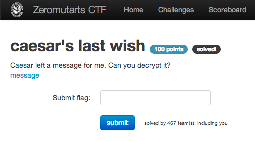

caesar's last wish
==================

Flag: **twenty_three_stabs_are_way_too_many**

The challenge flavortext says "Caesar left a message for me. Can you
decrypt it?" and links to a text file containing a cipher:

> zh zrxog qhyhu pdnh lw wkdw hdvb.. rxu hqfubswlrq lv rqh vwhs dkhdg!livi mw er mrgvihmfpi xlsyklx sj geiwevr alex ai amwl, ai viehmpc fipmizi, erh alex ai syvwipziw xlmro, ai mqekmri sxlivw xlmro epws. ai amwl xli jpek mw jpek{xairxc_xlvii_wxefw_evi_aec_xss_qerc}

This appears to be a whitespace- and punctuation-preserving cipher,
and given the flavortext it probably involves a Caesar cipher.

After [running the cipher through a range of shifts](caesar.py "Caesar cipher
Python script") and inspecting the output, we find that the first half of the
cipher was produced by a right shift of 3, and the second half by a right shift
of 4:

    -3
    we would never make it that easy.. our encryption is one step ahead!ifsf jt bo jodsfejcmf uipvhiu pg dbftbso xibu xf xjti, xf sfbejmz cfmjfwf, boe xibu xf pvstfmwft uijol, xf jnbhjof puifst uijol bmtp. xf xjti uif gmbh jt gmbh{uxfouz_uisff_tubct_bsf_xbz_upp_nboz}

    -4
    vd vntkc mdudq lzjd hs sgzs dzrx.. ntq dmbqxoshnm hr nmd rsdo zgdzc!here is an incredible thought of caesarn what we wish, we readily believe, and what we ourselves think, we imagine others think also. we wish the flag is flag{twenty_three_stabs_are_way_too_many}

The flag is thus `twenty_three_stabs_are_way_too_many`.

[« Return to challenge board](../README.md "Return to challenge board")
