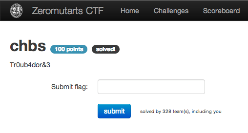

chbs
====

Flag: **correct_horse_battery_staple**

The challenge flavortext is "Tr0ub4dor&3". An Internet search on this string
shows that it is a reference to an [XKCD comic](http://xkcd.com/936/
"Tr0ub4dor&3 XKCD comic") on passwords.

The password used in the comic is "correct horse battery staple". Replacing the
spaces with underlines, the flag is thus `twenty_three_stabs_are_way_too_many`.
