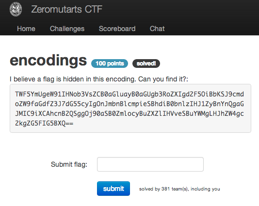

encodings
=========

Flag: **et_tu_brute**

The challenge flavortext says "I believe a flag is hidden in this encoding. Can
you find it?" and presents this encoded message:

> TWF5YmUgeW91IHNob3VsZCB0aGluayB0aGUgb3RoZXIgd2F5OiBbKSJ9cmdoZW9faGdfZ3J7dG55cyIgOnJmbnBlcmpieSBhdiB0bnlzIHJ1ZyBnYnQgaGJMIC9iXCAhcnB2QSggOj90aSB0ZmlocyBuZXZlIHVveSBuYWMgLHJhZW4gc2kgZG5FIG5BXQ==

The trailing equals signs suggest that the message is base64-encoded:

    >>> import base64
    >>> base64.b64decode("TWF5YmUgeW91IHNob3VsZCB0aGluayB0aGUgb3RoZXIgd2F5OiBbKSJ9cmdoZW9faGdfZ3J7dG55cyIgOnJmbnBlcmpieSBhdiB0bnlzIHJ1ZyBnYnQgaGJMIC9iXCAhcnB2QSggOj90aSB0ZmlocyBuZXZlIHVveSBuYWMgLHJhZW4gc2kgZG5FIG5BXQ==")
    'Maybe you should think the other way: [)"}rgheo_hg_gr{tnys" :rfnperjby av tnys rug gbt hbL /b\\ !rpvA( :?ti tfihs neve uoy nac ,raen si dnE nA]'

Obliging the decoded message, let's reverse the string:

    >>> print """)"}rgheo_hg_gr{tnys" :rfnperjby av tnys rug gbt hbL /b\ !rpvA( :?ti tfihs neve uoy nac ,raen si dnE nA"""[::-1]
    An End is near, can you even shift it?: (Avpr! \b/ Lbh tbg gur synt va ybjrepnfr: "synt{rg_gh_oehgr}")

We can see the telltale flag signature at the end. Is this a simple shift or
something more complicated? Knowing that `synt` maps to `flag`:

    >>> print ord("s") - ord("f")
    13
    >>> print ord("y") - ord("l")
    13

This looks like a standard rot13; let's un-shift it:

    >>> print """Avpr! \\b/ Lbh tbg gur synt va ybjrepnfr: "synt{rg_gh_oehgr}""".decode("rot13")
    Nice! \o/ You got the flag in lowercase: "flag{et_tu_brute}

The flag is thus `et_tu_brute`.
