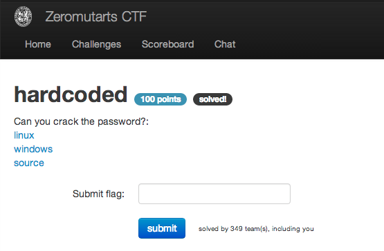

hardcoded
=========

Flag: **hardcoded_passwords_are_hardcoded**

The challenge flavortext says "Can you crack the password?" and links to Linux
and Windows executables and the source code for the program:

* [linux](hardcoded)
* [windows](hardcoded.exe)
* [source](hardcoded_redacted.c)

Running the program, we see that it prompts for a password which we probably
need to provide to receive the flag:

    $ ./hardcoded
    Password: test
    That was the wrong password.

Examining the source code, we see that a password is indeed hardcoded, which
means it will show up if we run `strings` on the executable:

    $ strings hardcoded | grep password
    That was the wrong password.
    SuperSecur3password!1
    password

We'll use `SuperSecur3password!1` to get the flag:

    $ ./hardcoded
    Password: SuperSecur3password!1

    Congratulations! Your flag is: "flag{hardcoded_passwords_are_hardcoded}"

The flag is thus `hardcoded_passwords_are_hardcoded`.

[« Return to challenge board](../README.md "Return to challenge board")
