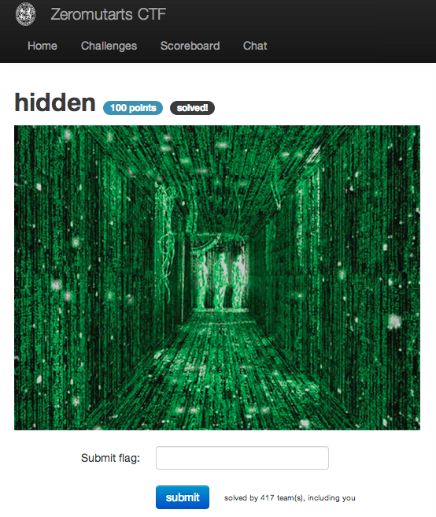

hidden
======

Flag: **oh_shit_you_must_be_the_chosen_one**

The challenge consists solely of an [image from the Matrix](images/hidden.jpg
"image from the Matrix").

Let's learn a bit more about the image by running it through `file`:

    $ file hidden.jpg
    hidden.jpg: JPEG image data, JFIF standard 1.01, comment: "flag{oh_shit_you_must_be_the_chosen_one}"

The flag is thus `oh_shit_you_must_be_the_chosen_one`.

[« Return to challenge board](../README.md "Return to challenge board")
