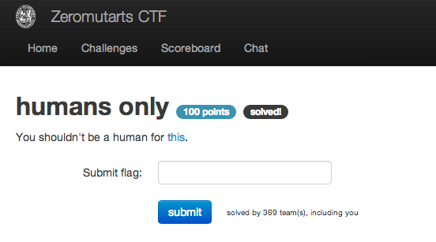
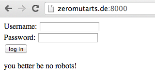
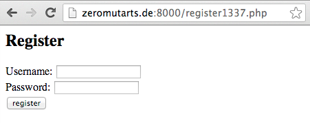
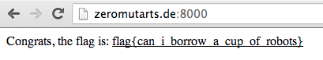

humans only
===========

Flag: **can_i_borrow_a_cup_of_robots**

The challenge flavortext says "You shouldn't be a human for this" with a link to
<http://zeromutarts.de:8000/>, which shows a login form:

Based on flavortext, let's visit `/robots.txt`. We find:

    User-agent: *
    Disallow: /register1337.php

    Disallow: /harming/humans
    Disallow: /ignoring/human/orders
    Disallow: /harm/to/self

Let's visit `/register1337.php`:

We are presented with a registration form, so let's register with throwaway
credentials and then use them on the login page. After logging in, we see:

The flag is thus `can_i_borrow_a_cup_of_robots`.
