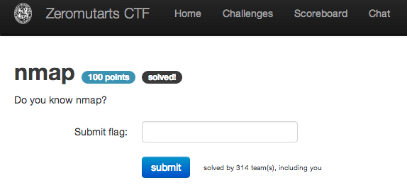

nmap
====

Flag: **hoist_the_anchor_we_leave_the_port**

The challenge flavortext says "Do you know nmap?".

Running `nmap` against the CTF host produces:

    $ nmap zeromutarts.de

    Starting Nmap 5.00 ( http://nmap.org ) at 2013-11-15 21:43 EST
    Interesting ports on zeromutarts.ikmfbs.ing.tu-bs.de (134.169.18.173):
    Not shown: 992 filtered ports
    PORT     STATE  SERVICE
    7/tcp    open   echo
    22/tcp   open   ssh
    80/tcp   open   http
    2222/tcp closed unknown
    3333/tcp closed dec-notes
    8000/tcp open   http-alt
    8080/tcp open   http-proxy
    8085/tcp closed unknown

    Nmap done: 1 IP address (1 host up) scanned in 10.62 seconds

The `echo` service running on port 7 is unusual; what happens if we connect to
that port?

    $ nc zeromutarts.de 7
    flag{hoist_the_anchor_we_leave_the_port}

The flag is thus `hoist_the_anchor_we_leave_the_port`.

[« Return to challenge board](../README.md "Return to challenge board")
