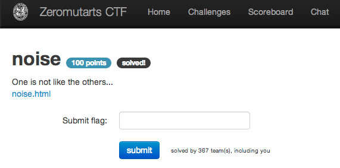

noise
=====

Flag: **the_user_checks_the_sourcecode**

The challenge flavortext says "One is not like the others..." and
links to an [HTML file](noise.html "HTML file") containing a number of
flags.

Viewing the source for the page, we see that one entry has been styled not to be
displayed:

    <a>flag{the_current_enhances_the_outgoing_opinion}</a> 
    <a>flag{the_reward_contributes_the_ray}</a> 
    <a style="display:none;">flag{the_user_checks_the_sourcecode}</a>
    <a>flag{the_person_tutors_the_experience}</a> 
    <a>flag{the_water_revamps_the_spotted_food}</a> 

That is the true flag, namely `the_user_checks_the_sourcecode`.
