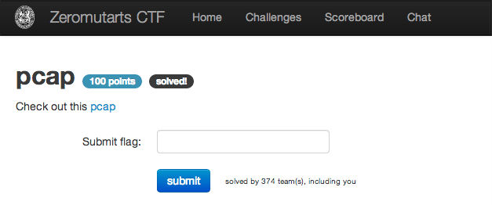
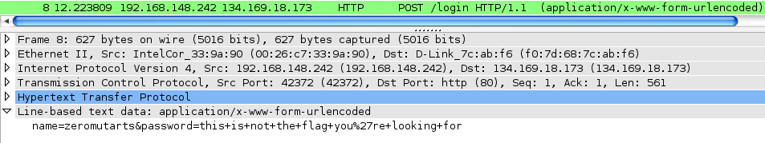
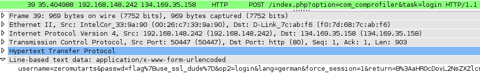

pcap
====

Flag: **use_ssl_dude**

The challenge flavortext says "Check out this [pcap](pcap.pcap "pcap")".

Opening the packet capture file with Wireshark, we see one HTTP (and thus
unencrypted) POST containing login credentials:

And then a second, which contains our flag:

The flag is thus `use_ssl_dude`.

[« Return to challenge board](../README.md "Return to challenge board")
