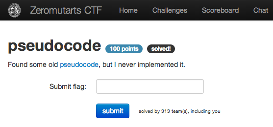

hardcoded
=========

Flag: **affe**

The challenge flavortext says "Found some old [pseudocode](pseudocode
"pseudocode"), but I never implemented it."

    import crypt

    label START
    $rand = random.range(21..29)
    if $rand mod 22 == 1
        continue
    else
        goto START
    $hash = crypt.md5($rand)
    print("flag{"+$hash[29]+$hash[6]+$hash[6]+$hash[14]+"}")
    quit

Examining the code, we see that it seeds an `md5` hash implementation with a
number between 21 and 29 that is 1 mod 22, and constructs a flag from bits in
the hash.

The hash function is deterministic for a given seed, and 23 is the only number
in the allowed range that is 1 mod 22, so we can implement the pseudocode using
23 as the seed to construct the flag:

    >>> import hashlib
    >>> m = hashlib.md5("23")
    >>> digest = m.hexdigest()
    >>> print digest[29] + digest[6] + digest[6] + digest[14]
    affe

The flag is thus `affe`.
