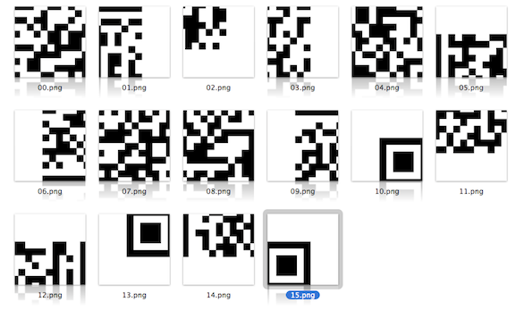
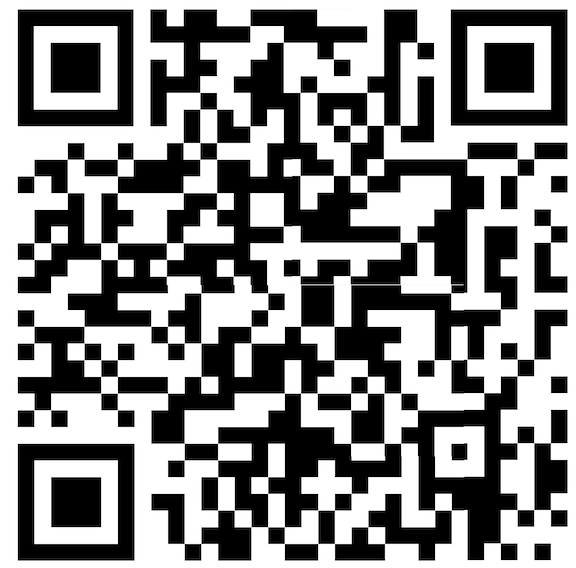
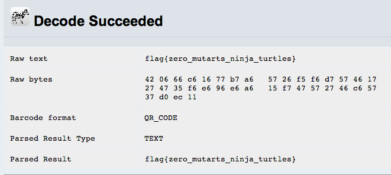

puzzle
======

Flag: **zero_mutarts_ninja_turtles**

The challenge flavortext says "I hope this doesn't leave you
[puzzled](puzzle.zip "puzzle Zip archive")." The link is to a Zip archive
containing 16 black and white square images:

These appear to be pieces of a QR code, so let's reassemble them:

Uploading the assembled QR code to an [online QR code decoder](http://zxing.org/
"online QR code decoder") reveals the flag:

The flag is thus `zero_mutarts_ninja_turtles`.

[« Return to challenge board](../README.md "Return to challenge board")
