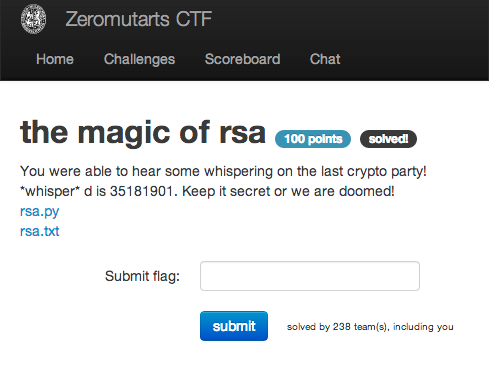

the magic of rsa
================

Flag: **you_got_the_basics_my_padawan**

The challenge flavortext says "You were able to hear some whispering on the last
crypto party! \*whisper\* d is 35181901. Keep it secret or we are doomed!" and
links to:

* [rsa.py](rsa.py "Python script")
* [rsa.txt](rsa.txt "Text file containing a list of numbers")

`rsa.txt` is a list of numbers. `rsa.py` is a short Python script that processes
`rsa.txt` and tells us to implement a function that will decrypt each number.

Given the name of the puzzle and the constants in the script, it is likely that
each number in `rsa.txt` is an RSA-encrypted letter, and putting the decrypted
letters together will give us the flag.

First, let's make sure we understand the constants:

* `n = 65354147` and is used as the modulus for public and private keys. `n` =
  `p * q`, where `p` and `q` are distinct prime numbers. `p`, `q`, and `n` are
  much larger in real RSA exchanges.

* `e = 13` and is used as the public key exponent: `c ≡ m^e (mod n)`, where `m`
  is the plaintext and `c` is the resulting ciphertext, i.e. a number in
  `rsa.txt` in this challenge. To choose `e`, we must first compute

    φ(n) = φ(p) * φ(q) = (p − 1) * (q − 1)

where `φ(x)` is [Euler's totient
function](https://en.wikipedia.org/wiki/Euler%27s_totient_function "Euler's
totient function"), the number of integers `≤ x` that are relatively prime to
`x`.

`e` is then chosen such that `e` and `φ(n)` are relatively prime. `e` is much
larger in real RSA exchanges.

Fortunately, we are given `e` so we don't have to worry about this!

* `d = 35181901` according to the flavortext and is used as the private key
exponent: `m ≡ c^d (mod n)`. `d` is the multiplicative inverse of `e` and is
supposed to be kept secret, so that only the holder of the secret can decrypt
the encrypted messages.

To recover the plaintext `m`, we need to compute `m ≡ c^d (mod n)`. Python's
built-in `pow` can do modular exponentiation, so that will be our decryption
function:

    import sys

    n = 65354147
    e = 13
    d = 35181901

    def decrypt(c):
        return pow(c, d, n)

    with open(sys.argv[1] , "r") as f:
        message = ""
        for line in f:
            message += chr(decrypt(int(line.strip())))
        print message

Running the script, we get:

    $ python rsa.py rsa.txt
    flag{you_got_the_basics_my_padawan}

The flag is thus `you_got_the_basics_my_padawan`.

If we want to see what constants for a real RSA private key look like, we can
generate one with:

    openssl genrsa -out private.pem 2048

and inspect it with

    openssl rsa -text -in private.pem

In this case, the modulus `n` is 256 bytes, made from primes `p` and `q` that
are 128 bytes each. The public exponent `e` is 65537, and the private exponent
`d` is 256 bytes.

[« Return to challenge board](../README.md "Return to challenge board")
