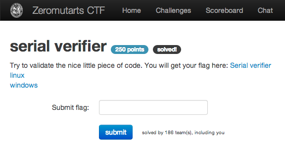
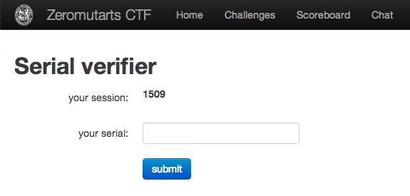

serial verifier
===============

Flag: **why_so_serial**

The challenge flavortext says "Try to validate the nice little piece of
code. You will get your flag here: Serial verifier" and links to:

* [linux](serial "Linux executable version of serial verifier")
* [windows](serial.exe "Windows executable version of serial verifier")

The serial verifier is a web form that shows you your session number and asks
you to submit the corresponding serial number for that session:

The linked executables verify the web form data. Let's run one of them to get a
feel for how it works:

    $ ./serial
    Welcome to the Serial Verifier!
    Please insert your personal Session ID:
    1509
    Thanks I got the ID 1509
    I would like to know your serial now
    asdf
    Sorry not valid!

We'll need to reverse the serial generation algorithm from the assembly for one
of the executables. Running `strings` against the ELF executable, we get:

    $ strings serial
    ...
    Welcome to the Serial Verifier!
    Please insert your personal Session ID:
    Not a number
    Thanks I got the ID %d
    I would like to know your serial now
    %d-%d-%d
    Sorry not valid!
     You did it!
    Wrong Code!
    ...

It looks like the format of the serial number might be `%d-%d-%d`.

We can look at the dissambly with `objdump -d`. [Here](serial.dump "serial
disassembly") is the full disassembly for the ELF executable. Below is part of
the disassembly for `main`, with annotations to the right walking through the
serial number generation algorithm:

    <main>:
        ...
        call   8048370 <__isoc99_scanf@plt> # Scan in 3 numbers.
        mov    0x1c(%esp),%eax      # Is var 1 > 0?
        test   %eax,%eax
        jle    8048540 <main+0xc3>
        mov    0x18(%esp),%eax	    # Is var 2 > 0?
        test   %eax,%eax
        jle    8048540 <main+0xc3>
        mov    0x14(%esp),%eax		# Is var 3 > 0?
        test   %eax,%eax
        jle    8048540 <main+0xc3>	# Is session # > 0?
        mov    0x10(%esp),%eax
        test   %eax,%eax
        jg     8048556 <main+0xd9>
        movl   $0x8048722,(%esp)
        call   8048340 <puts@plt>
        mov    $0x0,%eax
        jmp    80485ed <main+0x170>
        mov    0x1c(%esp),%edx      # Take session, move it into edx. We call it s1.
        mov    %edx,%eax            # Next 3 lines multiply s1 by 10:
        shl    $0x2,%eax            # x = s1 << 2
        add    %edx,%eax            # s1 = s1 + x
        add    %eax,%eax            # s1 = s1 + s1
        add    $0x2a,%eax           # Add 0x2a to s1. Net result: s1 = (0xa * session) + 0x2a.
        shl    $0x4,%eax            # Shift left by 0x4, same as multiplying by 0x10.
        mov    %eax,0x24(%esp)      # Save as s1, at 0x24(%esp)
        mov    0x1c(%esp),%eax      # Load session into %esp again.
        imul   $0x7b6,%eax,%eax     # s2 = session * 0x7b6
        add    $0x171d2,%eax        # s2 = session * 0x7b6 + 0x171d2
        mov    %eax,0x20(%esp)      # Save as s2, at 0x20(%esp)
        movl   $0x218,0x2c(%esp)    # s3 = 0x218
        movl   $0x0,0x28(%esp)      # Set up a counter for a loop: i = 0.
        jmp    80485a1 <main+0x124> # Loop:
        addl   $0x5,0x2c(%esp)      #     s3 += 5
        subl   $0x3,0x2c(%esp)      #     s3 -= 3
        addl   $0x1,0x28(%esp)      #     i++
        cmpl   $0x9,0x28(%esp)      #     if i <= 9:
        jle    8048592 <main+0x115> #        Go back to Loop
        mov    0x1c(%esp),%eax      # Move session into %eax.
        add    %eax,0x2c(%esp)      # s3 += session
        mov    0x18(%esp),%eax      # Does var 1 == s1?
        cmp    %eax,0x24(%esp)
        jne    80485dc <main+0x15f>
        mov    0x14(%esp),%eax      # Does var 2 == s2?
        cmp    %eax,0x20(%esp)
        jne    80485dc <main+0x15f>
        mov    0x10(%esp),%eax      # Does var 3 == s3?
        cmp    %eax,0x2c(%esp)
        jne    80485dc <main+0x15f>
        movl   $0x8048733,(%esp)    # Yes, print flag.
        call   8048340 <puts@plt>
        ...

Here is a Python script that executes the same algorithm:

    import sys

    session = int(sys.argv[1])

    s1 = 0x10 * (0xa * session + 0x2a)
    s2 = 0x7b6 * session + 0x171d2
    s3 = 0x218
    for i in range(10):
        s3 += 0x5
        s3 -= 0x3
    s3 += session

    print "%d-%d-%d" % (s1, s2, s3)

Using this script, we can generate the serial number for session 1509:

    $ python serial.py 1509
    242112-3073440-2065

Supplying that number in the web form reveals the flag, which is
`why_so_serial`.

[« Return to challenge board](../README.md "Return to challenge board")
