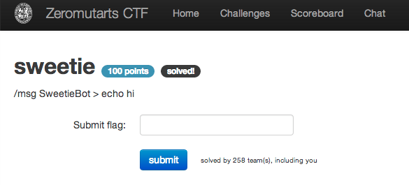

sweetie
=======

Flag: **set_phasers_to_hug**

The challenge flavortext says "/msg SweetieBot > echo hi", implying that we
should interact with an IRC bot. Given that the CTF had an IRC channel on
[freenode](http://freenode.net/ "freenode IRC network"), that seems like a good
network to try:

    -!- Irssi: Starting query in freenode with SweetieBot
    17:22 <me> > echo hi
    17:22 <SweetieBot> hi

SweetieBot is echoing what I am saying. Is `echo` just the typical shell
builtin?

    15:09 <me> > ls -al /
    15:09 <SweetieBot> total 56
    15:09 <SweetieBot> drwxr-xr-x 10 1001 1001     0 Oct 10 01:18 .
    15:09 <SweetieBot> drwxr-xr-x 10 1001 1001     0 Oct 10 01:18 ..
    15:09 <SweetieBot> 11 more lines ( http://sprunge.us/PHEc )

Looks like it. The pastebin contains:

    total 56
    drwxr-xr-x 10 1001 1001     0 Oct 10 01:18 .
    drwxr-xr-x 10 1001 1001     0 Oct 10 01:18 ..
    drwxr-xr-x  2 1001 1001     0 Oct 10 01:18 bin
    drwxr-xr-x  2 1001 1001     0 Oct 10 01:18 dev
    drwxr-xr-x  3 1001 1001     0 Oct 10 01:18 etc
    -rw-r--r--  1    0    0    25 Oct 10 01:18 flag
    -rwxr-xr-x  1 1001 1001   397 Oct 10 01:18 init
    drwxr-xr-x  2 1001 1001     0 Oct 10 01:18 lib
    dr-xr-xr-x 24    0    0     0 Oct 10 01:18 proc
    drwxr-xr-x  2 1001 1001     0 Oct 10 01:18 root
    -rw-r--r--  1 1001 1001 45640 Oct 10 01:18 sweetiebot.png
    drwxr-xr-x  2 1001 1001     0 Oct 10 01:18 tmp
    drwxr-xr-x  4 1001 1001     0 Oct 10 01:18 usr

Let's check out that `flag` file:

    15:09 <me> > cat /flag
    15:09 <SweetieBot> flag{set_phasers_to_hug}

The flag is thus `set_phasers_to_hug`.
