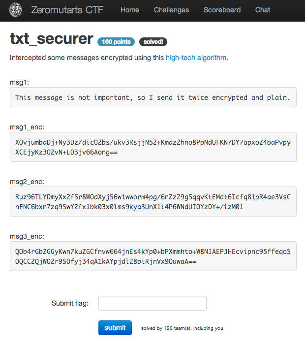

txt_securer
===========

Flag: **can_you_believe_xor_provides_perfect_security?**

The challenge flavortext says "Intercepted some messages encrypted using this
[high-tech algorithm](txt_securer.py "txt_securer Python script")" and provides
these messages:

> msg1:
> This message is not important, so I send it twice encrypted and plain.
>
> msg1_enc:
> XOvjumbdDj+Ny3Dz/dicO2bs/ukv3RsjjN52+Kmdz2hno8PpNdUFKN7DY7apxoZ4baPvpyXCEjyKz3O2vN+LO3jv66Aong==
>
> msg2_enc:
> Ruz96TLYDmyXx2f5r8WOdXyj56w1wworm4pg/6nZz29g5qqvKtEMdt6Icfq81pR4ae3VsCnFNC6bxn7zq9SwY2fx1bk03x0lms9kya3UnX1t4P6WNdUIOYzDY+/izM01
>
> msg3_enc:
> QOb4rGbZGGyKwn7kuZGCfnvw664jnEs4kYp0+bPXmmhto+W8NJAEPJHEcvipnc95ffeqoSOQCC2QjWO2r9SOfyj34qA1kAYpjdl28biRjnVx9OuwaA==

The linked script shows that the encryption and decryption mechanisms are just
an XOR with a repeating 16-byte key:

    import base64
    import os

    def xor(data, key):
        return "".join(map(lambda (x,y): chr(ord(x) ^ ord(y)), zip(data, key*(len(data)/len(key)+1))))

    keylen = 16

    def generate_key():
        return os.urandom(keylen)

    def encrypt(data, key):
        return base64.b64encode(xor(data, key))

    def decrypt(data, key):
        return xor(base64.b64decode(data), key)

We have both a message `msg1` and the resulting ciphertext `msg1_enc`.

We know that `msg1_enc` = `msg1 ^ key`. Thus:

    msg1_enc ^ msg1 = msg1 ^ key ^ msg1 = key

If we XOR `msg1` and `msg1_enc1`, we can recover the key to decrypt the
remaining messages:

    msg1 = "This message is not important, so I send it twice encrypted and plain."
    msg1_enc = "XOvjumbdDj+Ny3Dz/dicO2bs/ukv3RsjjN52+Kmdz2hno8PpNdUFKN7DY7apxoZ4baPvpyXCEjyKz3O2vN+LO3jv66Aong=="

    key = xor(base64.b64decode(msg1_enc), msg1)
    key = key[:16]

    msg2_enc = "Ruz96TLYDmyXx2f5r8WOdXyj56w1wworm4pg/6nZz29g5qqvKtEMdt6Icfq81pR4ae3VsCnFNC6bxn7zq9SwY2fx1bk03x0lms9kya3UnX1t4P6WNdUIOYzDY+/izM01"
    msg3_enc = "QOb4rGbZGGyKwn7kuZGCfnvw664jnEs4kYp0+bPXmmhto+W8NJAEPJHEcvipnc95ffeqoSOQCC2QjWO2r9SOfyj34qA1kAYpjdl28biRjnVx9OuwaA=="

    print decrypt(msg2_enc, key)
    print decrypt(msg3_enc, key)

Running the revised `txt_securer.py`, we get:

    $ python txt_securer.py
    Now the important message with the flag: "flag{can_you_believe_xor_provides_perfect_security?}".
    Here is third message, to confuse our oponent, but he can't read this message anyway.

The flag is thus `can_you_believe_xor_provides_perfect_security?`.

[« Return to challenge board](../README.md "Return to challenge board")
