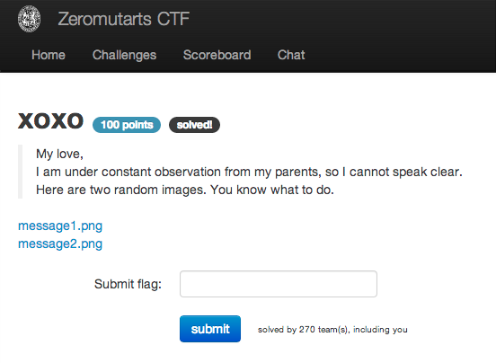
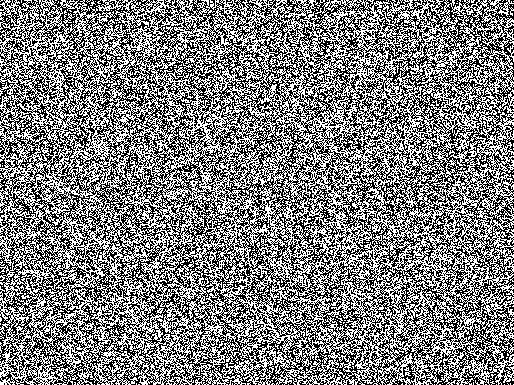
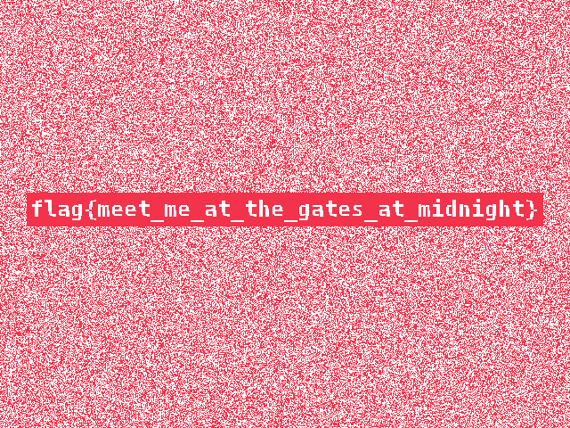

xoxo
====

Flag: **meet_me_at_the_gates_at_midnight**

The challenge flavortext says:

> My love,

> I am under constant observation from my parents, so I cannot speak clear.

> Here are two random images. You know what to do.

and links to two PNGs:

* [message1.png](images/xoxo-message1.png "message1.png")
* [message2.png](images/xoxo-message2.png "message2.png")

Given the title of the challenge, it seems like we should XOR or
otherwise diff these two images. Using the ImageMagick command line
utility `compare` to diff the images:

    compare xoxo-message1.png xoxo-message2.png -compose src diff.png

We get this resulting image diff:

The flag is thus `meet_me_at_the_gates_at_midnight`.

[« Return to challenge board](../README.md "Return to challenge board")
